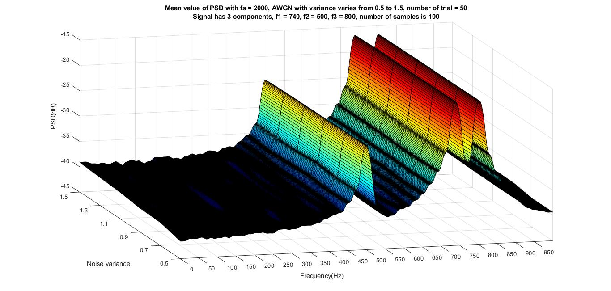
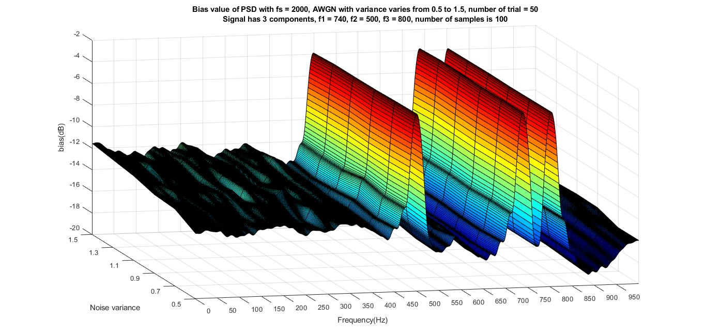
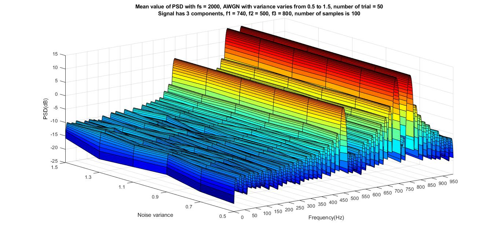
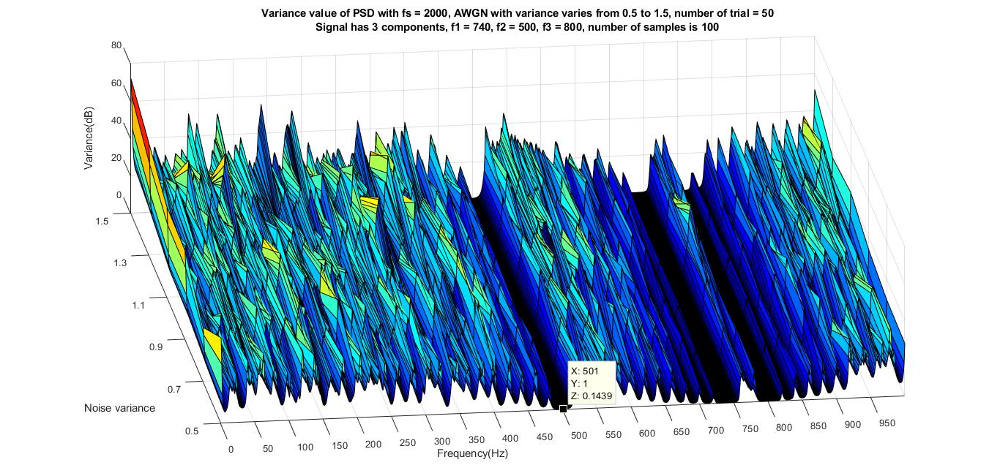
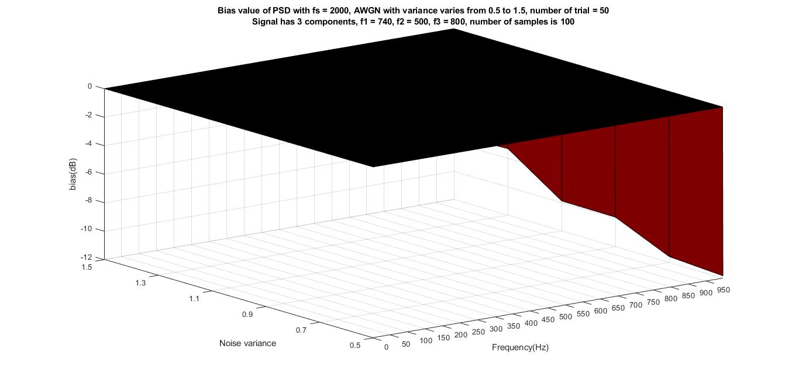

# Blackman-Turkey

## blackman_turkey.m
- MATLAB code for Blackman-Turkey method using Barlett window to analyze PSD of signal with 3 sinusoid components
- Result

## BT_efficient.m
- Using Monte Carlo simulation to evaluate efficiency of the algorithm
- Mean efficieny

- Variance efficieny

- Bias efficient

# Minimym Variance

## minimum_variance.m
- MATLAB code for Minimum variance method to analyze PSD of signal with 3 sinusoid components
- Result

## MV_efficient.m
- Using Monte Carlo simulation to evaluate efficiency of the algorithm
- Mean efficieny

- Variance efficieny

- Bias efficient

